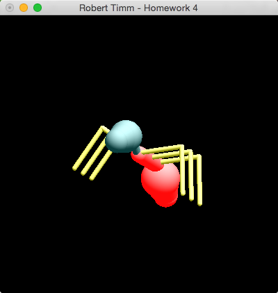
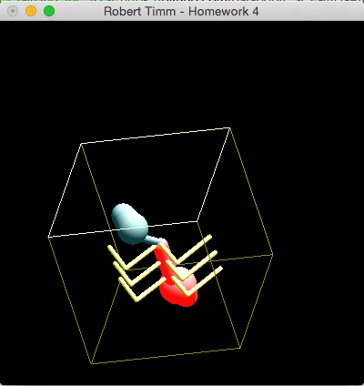

## CSCE-441-Project-4 Forward Kinematics & Model Rendering

### Notes
For this project we were tasked with creating an insect from OpenGL native polygons. My implementation of this assignment was to create base objects for rendering the each body part of the ant. I was able to accomplish this with a base body part that was composed of a cylinder with two spheres (one at each end with matching diameters). With this base object I was able to apply scaling at either end to represent the head portion of the ant, the thorax, abdomen, and legs. This assignment also required that we understand the core rendering techniques of forward kinematics when translating, scaling and moving body parts. All joints the user must control must retain limits to prevent joints from over-extending.  I received an A on this assignment.

### Compile & Run
* Navigate to this repo after cloning it to your local development environment.
* Type `make`
* To run type `./main`

### Controls
* Press `j` to select a joint on the ant to manipulate with the `+` & `-` keys. `j` will cycle through the neck, base of the legs and the tip of the legs.
* `v` to select the view mode controlled by the mouse. This will allow you to use your mouse to rotate, scale and translate the ant.
* `b` to toggle a bounding box around the ant. I used this for debugging my application.
* `q` to quit.

### Screenshots

