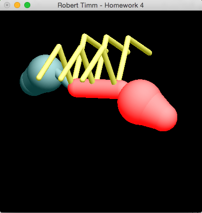

## CSCE-441-Project-4 Forward Kinematics & Model Rendering

### Notes
For this project we were tasked with creating an insect from OpenGL native polygons. My implementation of this assignment was to create base objects for rendering the each body part of the ant. I was able to accomplish this with a base body part that was composed of a cylinder with two spheres (one at each end with matching diameters). With this base object I was able to apply scaling at either end to represent the head portion of the ant, the thorax, abdomen, and legs. This assignment also required that we understand the core rendering techniques of forward kinematics when translating, scaling and moving body parts. All joints the user must control must retain limits to prevent joints from over-extending.  I received an A on this assignment.

### Compile & Run
* Navigate to this repo after cloning it to your local development environment.
* Type `make`
* To run type `./main`

### Controls
* Press `j` to select a joint on the ant to manipulate with the `+` & `-` keys. `j` will cycle through the neck, base of the legs and the tip of the legs.
* `v` to select the view mode controlled by the mouse. This will allow you to use your mouse to rotate, scale and translate the ant.
* `b` to toggle a bounding box around the ant. I used this for debugging my application.
* `q` to quit.

### Screenshots

### Plagiarism Notice
If you are working on an assignment for a University or High School course you must check with your professor and/or school's guidelines on plagiarism before copying any work found in this codebase. The author of this code is not to be held responsible for acts of cheating or misconduct. The author, much like the creator of a scholastic paper or article has decided to post this codebase for educational purposes. If you are a professor or course admin that is having an issue with cheating in your class, please feel free to contact the author.

### License
Copyright (c) 2015 Robert Timm

Permission is hereby granted, free of charge, to any person obtaining a copy of this software and associated documentation files (the "Software"), to deal in the Software without restriction, including without limitation the rights to use, copy, modify, merge, publish, distribute, sublicense, and/or sell copies of the Software, and to permit persons to whom the Software is furnished to do so, subject to the following conditions:

The above copyright notice and this permission notice shall be included in all copies or substantial portions of the Software.

THE SOFTWARE IS PROVIDED "AS IS", WITHOUT WARRANTY OF ANY KIND, EXPRESS OR IMPLIED, INCLUDING BUT NOT LIMITED TO THE WARRANTIES OF MERCHANTABILITY, FITNESS FOR A PARTICULAR PURPOSE AND NONINFRINGEMENT. IN NO EVENT SHALL THE AUTHORS OR COPYRIGHT HOLDERS BE LIABLE FOR ANY CLAIM, DAMAGES OR OTHER LIABILITY, WHETHER IN AN ACTION OF CONTRACT, TORT OR OTHERWISE, ARISING FROM, OUT OF OR IN CONNECTION WITH THE SOFTWARE OR THE USE OR OTHER DEALINGS IN THE SOFTWARE.
